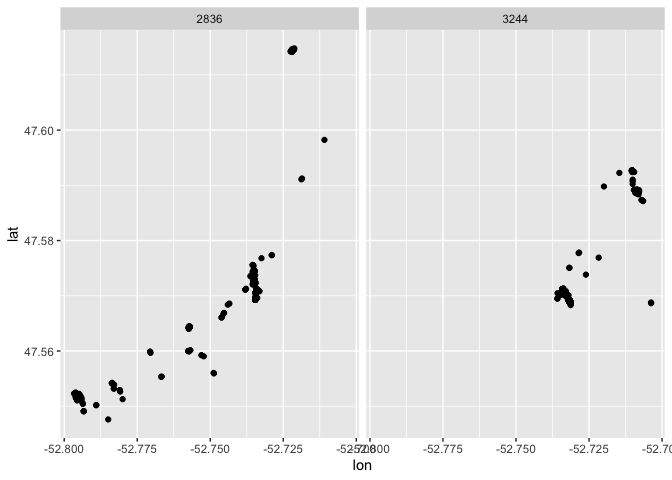
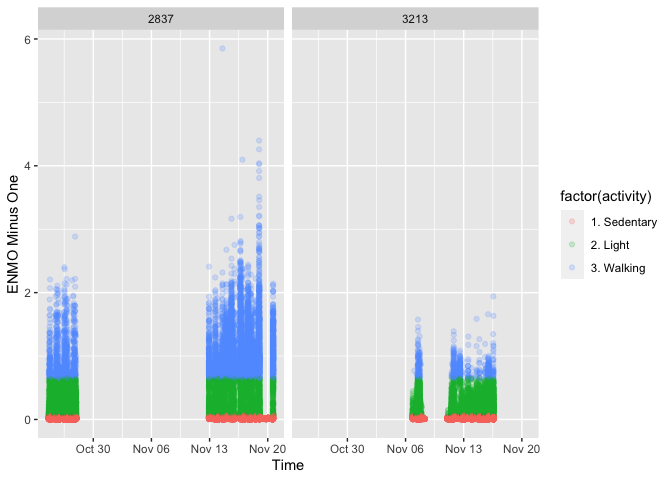

```r
library(tidyverse)
```

```
## ── Attaching packages ─────────────────────────────────────── tidyverse 1.3.1 ──
```

```
## ✓ ggplot2 3.3.3     ✓ purrr   0.3.4
## ✓ tibble  3.1.2     ✓ dplyr   1.0.6
## ✓ tidyr   1.1.3     ✓ stringr 1.4.0
## ✓ readr   1.4.0     ✓ forcats 0.5.1
```

```
## ── Conflicts ────────────────────────────────────────── tidyverse_conflicts() ──
## x dplyr::filter() masks stats::filter()
## x dplyr::lag()    masks stats::lag()
```

```r
library(lubridate)
```

```
## 
## Attaching package: 'lubridate'
```

```
## The following objects are masked from 'package:base':
## 
##     date, intersect, setdiff, union
```

```r
library(stringr)
```

# Accelerometer Data Wrangling

These data are from Ethica Data, which is app manufacturer our INTERACT team has been working with for the past 7 years. 


```r
accel_data <- read_csv("accel_sample_data.csv")
```

```
## 
## ── Column specification ────────────────────────────────────────────────────────
## cols(
##   user_id = col_double(),
##   date = col_character(),
##   device_id = col_character(),
##   record_time = col_datetime(format = ""),
##   timestamp = col_character(),
##   accu = col_double(),
##   x_axis = col_double(),
##   y_axis = col_double(),
##   z_axis = col_double()
## )
```

```r
glimpse(accel_data)
```

```
## Rows: 2,429,619
## Columns: 9
## $ user_id     <dbl> 2837, 2837, 2837, 2837, 2837, 2837, 2837, 2837, 2837, 2837…
## $ date        <chr> "2017-10", "2017-10", "2017-10", "2017-10", "2017-10", "20…
## $ device_id   <chr> "153C5CD8CDD244CA856687EE867F6C81", "153C5CD8CDD244CA85668…
## $ record_time <dttm> 2017-10-24 15:44:41, 2017-10-24 15:44:41, 2017-10-24 15:4…
## $ timestamp   <chr> "2e400fd0-b8d3-11e7-9b33-1306489ee1e5", "2e400fd2-b8d3-11e…
## $ accu        <dbl> 0, 0, 0, 0, 0, 0, 0, 0, 0, 0, 0, 0, 0, 0, 0, 0, 0, 0, 0, 0…
## $ x_axis      <dbl> -0.93179333, -0.40611646, -0.35314474, -0.19587563, -0.161…
## $ y_axis      <dbl> 2.588132, 2.408118, 2.220173, 2.430713, 2.475006, 2.466177…
## $ z_axis      <dbl> 9.598953, 9.465476, 9.619453, 9.405472, 9.736021, 9.469666…
```

```r
table(accel_data$user_id)
```

```
## 
##    2837    3213 
## 1414144 1015475
```

# Accel data processing

Tasks

1. Decide which method we are going to use for data processing
    * ActiGraph Activity Counts (AAC) - [https://cran.r-project.org/web/packages/activityCounts/index.html](https://cran.r-project.org/web/packages/activityCounts/index.html)
    * Euclidean Norm Minus One (ENMO) - [https://cran.r-project.org/web/packages/GGIR/index.html](https://cran.r-project.org/web/packages/GGIR/index.html)
    * Monitor Independent Movement Summary (MIMS) [https://cran.r-project.org/web/packages/MIMSunit/index.html](https://cran.r-project.org/web/packages/MIMSunit/index.html)
    
### Sorting out time

These data are different from most accelerometer data because the phone does not capture accelerometer data like a traditional research grade device. It optimizes for battery life and often does not have a consistent number of hertz per second. So unlike data were you will set the hertz to 30 or 100 this will be different. 

# ou will probably have to resample the data... but we are not going to do that today because don't have time. 


```r
accel_data$time_factor <- as.factor(accel_data$record_time)

accel_data <- accel_data %>%
  group_by(record_time) %>%
  mutate(
         milli = row_number()
  )

summary(accel_data$milli)
```

```
##    Min. 1st Qu.  Median    Mean 3rd Qu.    Max. 
##   1.000   3.000   5.000   4.769   7.000  30.000
```

# Dealing with time


```r
accel_data$day <- day(accel_data$record_time)  ## Create an hour variable
accel_data$hour <- hour(accel_data$record_time)  ## Create an hour variable
accel_data$minute <- minute(accel_data$record_time)  ## Create a minute variable
accel_data$second <- second(accel_data$record_time)  ## Create a second variable
```

# Calculating ENMO


```r
accel_data <- accel_data %>%
                mutate(
                  x_g = x_axis/9.80665,
                  y_g = y_axis/9.80665,
                  z_g = z_axis/9.80665,
                  enmo = x_g^2+y_g^2+z_g^2,
                  enmo_m1 = (x_g^2+y_g^2+z_g^2)-1
                )
```


```r
summary(accel_data$enmo_m1)
```

```
##     Min.  1st Qu.   Median     Mean  3rd Qu.     Max. 
## -0.99862  0.00184  0.01142  0.02636  0.01603 58.98072
```

```r
accel_data <- accel_data %>% filter(enmo_m1 < 10)
```

 

```r
accel_sec <- accel_data %>%
  group_by(user_id, day, hour, minute, second) %>%
  summarise(
         time = first(record_time), 
         user_id = first(user_id),
         m_x_g = mean(x_g),
         m_y_g = mean(y_g),
         m_z_g = mean(z_g),
         enmo_m1 = mean(abs(enmo_m1))
        )
```

```
## `summarise()` has grouped output by 'user_id', 'day', 'hour', 'minute'. You can override using the `.groups` argument.
```


#### 5. Use the cut points from this [paper](https://journals.plos.org/plosone/article?id=10.1371/journal.pone.0164045) and create a new variable called `activity`. 

| Activity | Cut Point (enmo_m1) | 
|----------|-----------|
| Sedentary | <= 6.600 |
| Moderate | >=6.610 to <64.810 | 
| Walking | >= 64.8 to max |


```r
accel_sec <- accel_sec %>%
	mutate(activity = case_when(
		enmo_m1 <= 0.06610 ~ "1. Sedentary",
		enmo_m1 > 0.06610 & enmo_m1 <= 0.6480 ~ "2. Light",
		enmo_m1 > 0.6481 ~ "3. Walking",
		TRUE ~ "other"
	))

table(accel_sec$activity)
```

```
## 
## 1. Sedentary     2. Light   3. Walking 
##       267328        17014         6126
```


```r
fig1 <- ggplot(accel_sec, aes(x = time, y = enmo_m1)) + 
          geom_point(alpha = 1/10) + 
            xlab("Time") +
            ylab("ENMO Minus One") +
        facet_wrap(~ user_id)
plot(fig1)
```

<!-- -->


```r
fig2 <- ggplot(accel_sec, aes(x = time, y = enmo_m1)) + 
          geom_point(alpha = 1/5, aes(colour = factor(activity))) + 
            xlab("Time") +
            ylab("ENMO Minus One") +
        facet_wrap(~ user_id)
plot(fig2)
```

<!-- -->
