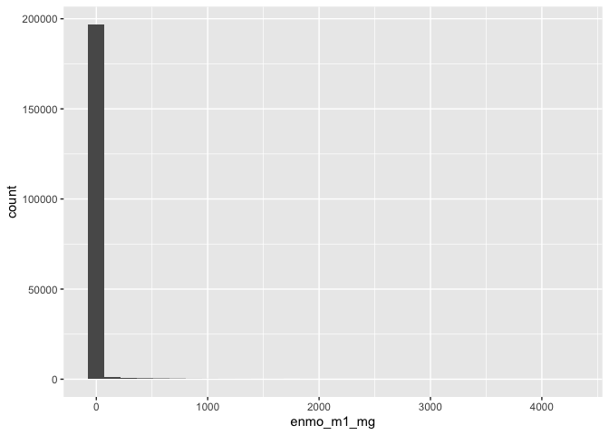
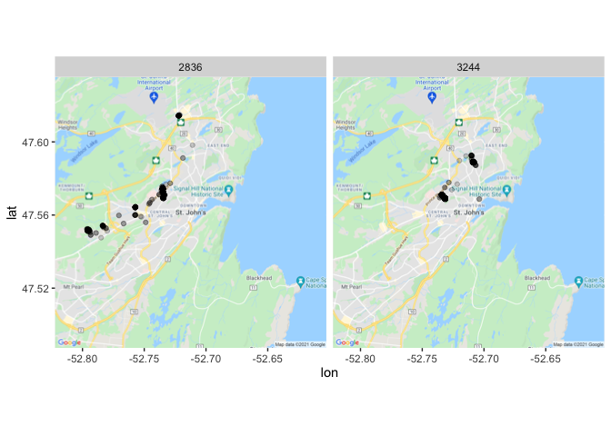
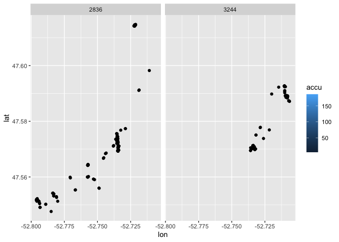
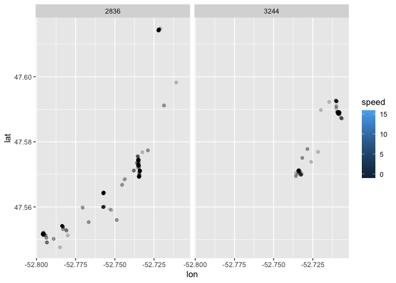
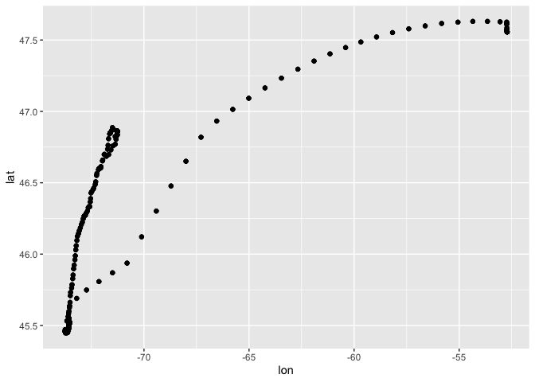
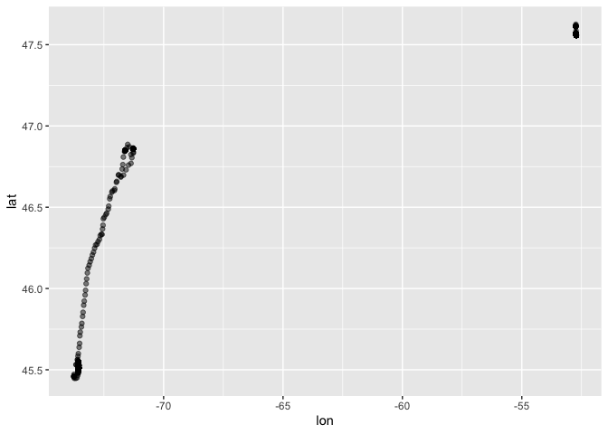
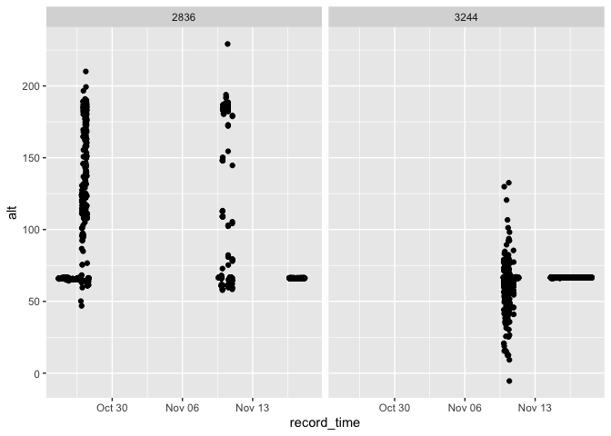
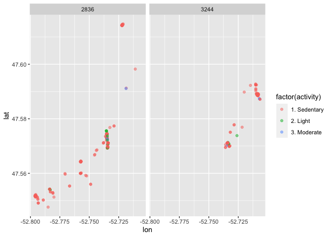

# Download the sample data here: 

1. [Accel Sample Data](https://www.dropbox.com/s/u8kdsmvkullbv97/accel_sample_data.csv?dl=0) 257.8MB
2. [GPS Sample Data](https://www.dropbox.com/s/c1iaj76j2kafebh/gps_sample_data.csv?dl=0) 1.2MB
3. [GPS Drift Data Sample](https://www.dropbox.com/s/c1w0rglr681nurn/gps_3213.csv?dl=0) 1.7MB

# Accelerometer Data Wrangling

These data are from Ethica Data, which is app manufacturer our INTERACT team has been working with for the past 7 years.

## Tasks

1. Read in and check data
2. Check time stamps and consistency
3. Data processing 
    * Check frequency for selected method
4. Wearing? 
5. Summarize data
6. Classification

### 1. Read in and check data


```r
accel_data <- read_csv("accel_sample_data.csv")
```

```
## Warning: Missing column names filled in: 'X1' [1]
```

```
## 
## ── Column specification ────────────────────────────────────────────────────────
## cols(
##   X1 = col_double(),
##   user_id = col_double(),
##   date = col_character(),
##   device_id = col_character(),
##   record_time = col_datetime(format = ""),
##   timestamp = col_character(),
##   accu = col_double(),
##   x_axis = col_double(),
##   y_axis = col_double(),
##   z_axis = col_double()
## )
```

```r
glimpse(accel_data)
```

```
## Rows: 1,643,202
## Columns: 10
## $ X1          <dbl> 1, 2, 3, 4, 5, 6, 7, 8, 9, 10, 11, 12, 13, 14, 15, 16, 17,…
## $ user_id     <dbl> 2836, 2836, 2836, 2836, 2836, 2836, 2836, 2836, 2836, 2836…
## $ date        <chr> "2017-11", "2017-11", "2017-11", "2017-11", "2017-11", "20…
## $ device_id   <chr> "DF184FF5942648B3AEA0AB98684E9F86", "DF184FF5942648B3AEA0A…
## $ record_time <dttm> 2017-11-09 14:23:48, 2017-11-09 14:23:48, 2017-11-09 14:2…
## $ timestamp   <chr> "47a61080-c55f-11e7-8d83-191d1de0632f", "47bb1f20-c55f-11e…
## $ accu        <dbl> 0, 0, 0, 0, 0, 0, 0, 0, 0, 0, 0, 0, 0, 0, 0, 0, 0, 0, 0, 0…
## $ x_axis      <dbl> 0.03725976, 0.04129998, 0.04833294, 0.06045359, 0.05746084…
## $ y_axis      <dbl> 0.02304419, 0.01556231, 0.03561375, 0.04908114, 0.02902970…
## $ z_axis      <dbl> 9.843910, 9.821165, 9.846004, 9.842862, 9.825953, 9.825205…
```

```r
table(accel_data$user_id)
```

```
## 
##   2836   3244 
## 860688 782514
```

### 2. Check time stamps and consistency

These data are different from most accelerometer data because the phone does not capture accelerometer data like a traditional research grade device. It optimizes for battery life and often does not have a consistent number of hertz per second. So unlike data were you will set the hertz to 30 or 100 this will be different. 

In our case, in real life we would have to resample the data... but we are not going to do that today because don't have time. 


```r
accel_data$time_factor <- as.factor(accel_data$record_time)

accel_data <- accel_data %>%
  group_by(record_time) %>%
  mutate(
         milli = row_number(),
         n = n()
  )

summary(accel_data$milli)
```

```
##    Min. 1st Qu.  Median    Mean 3rd Qu.    Max. 
##   1.000   3.000   5.000   4.999   7.000  97.000
```

#### Dealing with time


```r
accel_data$day <- day(accel_data$record_time)  ## Create an hour variable
accel_data$hour <- hour(accel_data$record_time)  ## Create an hour variable
accel_data$minute <- minute(accel_data$record_time)  ## Create a minute variable
accel_data$second <- second(accel_data$record_time)  ## Create a second variable
```

### 3. Data processing 

Common data processing methods

1. Decide which method we are going to use for data processing
    * ActiGraph Activity Counts (AAC) - [https://cran.r-project.org/web/packages/activityCounts/index.html](https://cran.r-project.org/web/packages/activityCounts/index.html)
    * Euclidean Norm Minus One (ENMO) - [https://cran.r-project.org/web/packages/GGIR/index.html](https://cran.r-project.org/web/packages/GGIR/index.html)
    * Monitor Independent Movement Summary (MIMS) [https://cran.r-project.org/web/packages/MIMSunit/index.html](https://cran.r-project.org/web/packages/MIMSunit/index.html)

#### Calculating ENMO


```r
accel_data <- accel_data %>%
                mutate(
                  x_g = x_axis/9.80665,
                  y_g = y_axis/9.80665,
                  z_g = z_axis/9.80665,
                  enmo = x_g^2+y_g^2+z_g^2,
                  enmo_m1 = (x_g^2+y_g^2+z_g^2)-1
                )

summary(accel_data$enmo_m1)
```

```
##     Min.  1st Qu.   Median     Mean  3rd Qu.     Max. 
## -0.99653  0.00034  0.00238  0.00391  0.00438 70.11597
```

```r
accel_data <- dplyr::filter(accel_data, enmo_m1 < 20) # Filtering ENMO < 20

summary(accel_data$enmo_m1)
```

```
##      Min.   1st Qu.    Median      Mean   3rd Qu.      Max. 
## -0.996526  0.000339  0.002383  0.003753  0.004383 19.905638
```

### 4. Wearing? 

I'm just skipping over this for now. The very common Choi algorithm is a good place for wearing detection. There are others as well. You can find the Choi algorithm in a bunch of different packages including [sleepr](https://rdrr.io/github/dipetkov/actigraph.sleepr/man/apply_choi.html).

### 5. Summarize data

Here we are summarizing the data at the second level (very common) but also sometimes methods use 5 second windows. Windows might be fixed (every 5 seconds) or moving (overlapping 5 seconds). Depends on the method. 


```r
accel_sec <- accel_data %>%
  group_by(user_id, day, hour, minute, second) %>%
  summarise(
         time = first(record_time), 
         user_id = first(user_id),
         m_x_g = mean(x_g),
         m_y_g = mean(y_g),
         m_z_g = mean(z_g),
         enmo_m1 = mean(abs(enmo_m1)),
         enmo_m1_mg = enmo_m1*1000
        )
```

```
## `summarise()` has grouped output by 'user_id', 'day', 'hour', 'minute'. You can override using the `.groups` argument.
```

```r
rm(accel_data)

summary(accel_sec$enmo_m1_mg)
```

```
##     Min.  1st Qu.   Median     Mean  3rd Qu.     Max. 
##    0.007    1.808    2.831    7.989    4.291 4250.402
```

```r
### Histogram of ENMO

ggplot(accel_sec, aes(enmo_m1_mg)) +
        geom_histogram()
```

```
## `stat_bin()` using `bins = 30`. Pick better value with `binwidth`.
```

<!-- -->

### 6. Classification

We are going to use the cut points from this [paper](https://doi.org/10.3389/fspor.2020.579278) and create a new variable called `activity`. 

| Activity | Cut Point (enmo_m1) | 
|----------|-----------|
| Sedentary | <= 255 |
| Moderate | > 255 to <= 588 | 
| Moderate | >= 588 to max |

*Note. Don't do this at home. Should make sure your sample frequency is correct for the method you are using.*


```r
accel_sec <- accel_sec %>%
	mutate(activity = case_when(
		enmo_m1_mg <= 255 ~ "1. Sedentary",
		enmo_m1_mg > 255 & enmo_m1_mg <= 588 ~ "2. Light",
		enmo_m1_mg > 588 ~ "3. Moderate",
		TRUE ~ "other"
	))

table(accel_sec$activity)
```

```
## 
## 1. Sedentary     2. Light  3. Moderate 
##       198322          864          389
```

```{}
fig1 <- ggplot(accel_sec, aes(x = time, y = enmo_m1)) + 
          geom_point(alpha = 0.01, aes(colour = factor(activity))) + 
            xlab("Time") +
            ylab("ENMO") +
        facet_wrap(~ user_id)
plot(fig1)
```

# GPS Sample Data

## Tasks

1. Read in and make a map
2. Check accuracy, type, and speed
3. Check time series

### 1. Read in and make a map


```r
gps_data <- read_csv("gps_sample_data.csv")
```

```
## Warning: Missing column names filled in: 'X1' [1]
```

```
## 
## ── Column specification ────────────────────────────────────────────────────────
## cols(
##   X1 = col_double(),
##   user_id = col_double(),
##   date = col_character(),
##   device_id = col_character(),
##   record_time = col_datetime(format = ""),
##   timestamp = col_character(),
##   accu = col_double(),
##   alt = col_double(),
##   bearing = col_double(),
##   lat = col_double(),
##   lon = col_double(),
##   provider = col_character(),
##   satellite_time = col_datetime(format = ""),
##   speed = col_double()
## )
```

```r
glimpse(gps_data)
```

```
## Rows: 6,204
## Columns: 14
## $ X1             <dbl> 1, 2, 3, 4, 5, 6, 7, 8, 9, 10, 11, 12, 13, 14, 15, 16, …
## $ user_id        <dbl> 2836, 2836, 2836, 2836, 2836, 2836, 2836, 2836, 2836, 2…
## $ date           <chr> "2017-11", "2017-11", "2017-11", "2017-11", "2017-11", …
## $ device_id      <chr> "DF184FF5942648B3AEA0AB98684E9F86", "DF184FF5942648B3AE…
## $ record_time    <dttm> 2017-11-09 14:23:48, 2017-11-09 14:23:48, 2017-11-09 1…
## $ timestamp      <chr> "47a9ba00-c55f-11e7-8d83-191d1de0632f", "47a9ba02-c55f-…
## $ accu           <dbl> 65.0000, 65.0000, 65.0000, 65.0000, 65.0000, 65.0000, 6…
## $ alt            <dbl> 66.44848, 66.44848, 66.49751, 66.52485, 66.47801, 66.67…
## $ bearing        <dbl> -1, -1, -1, -1, -1, -1, -1, -1, -1, -1, -1, -1, -1, -1,…
## $ lat            <dbl> 47.57115, 47.57115, 47.57115, 47.57115, 47.57115, 47.57…
## $ lon            <dbl> -52.73409, -52.73409, -52.73407, -52.73407, -52.73408, …
## $ provider       <chr> "gps", "gps", "gps", "gps", "gps", "gps", "gps", "gps",…
## $ satellite_time <dttm> 2017-11-09 14:17:25, 2017-11-09 14:23:48, 2017-11-09 1…
## $ speed          <dbl> -1, -1, -1, -1, -1, -1, -1, -1, -1, -1, -1, -1, -1, -1,…
```

Note that we have two timestamps. One is called `record_time` one is called `satellite_time`. The `satellite_time` is the time recorded by the satellite. That time is extremely accurate and should be taken as correct. The `record_time` is the time on the users phone. 

### Map part 1 

```r
gps_plot_1 <- ggplot(gps_data) + 
                  geom_point(aes(x = lon, y = lat)) +
                  facet_wrap(~ user_id)
plot(gps_plot_1)
```

<!-- -->

### Basemap from Google Maps

You need a Google Maps API key for this to work. You can register one here [https://developers.google.com/maps/documentation/maps-static/get-api-key](https://developers.google.com/maps/documentation/maps-static/get-api-key). Setup the key this way using R and the `ggmap` package and this tutorial [https://www.littlemissdata.com/blog/maps](https://www.littlemissdata.com/blog/maps).


```r
canada_basemap <- get_map(location = "St. John's, Newfoundland, Canada",
                     source = "google",
                     maptype = "roadmap", crop = FALSE,
                     zoom = 12)
```

```
## Source : https://maps.googleapis.com/maps/api/staticmap?center=St.%20John's,%20Newfoundland,%20Canada&zoom=12&size=640x640&scale=2&maptype=roadmap&language=en-EN&key=xxx-9rGQuKs
```

```
## Source : https://maps.googleapis.com/maps/api/geocode/json?address=St.+John's,+Newfoundland,+Canada&key=xxx-9rGQuKs
```

### Combine the two maps


```r
maps_points <- ggmap(canada_basemap) + 
                  geom_point(aes(x = lon, y = lat), data = gps_data, alpha = 0.2) + 
                  facet_wrap(~ user_id)

plot(maps_points)
```

<!-- -->

### 2. Check locations and accuracy

Quick list of things that might happen when you are checking

1. Points at lat,lon = 0.00000,0.00000 [https://goo.gl/maps/h39dCqtZLzFRcYmUA](https://goo.gl/maps/h39dCqtZLzFRcYmUA). Sometimes the GPS resets or goes a bit haywire and you end up with points at this location. Need to remove them. 
2. Satellite drift happens when the GPS gets stuck tracking the satellite rather than the person. It looks like the person. It looks like someone might be on a plane. Good way to filter this to check speed and filter extremely high speeds. 
3. Point cloud or star. This is common when someone stays at one location for a long time but you get inaccuracies at every GPS point so you up with something that looks like a star. We will talk about methods to deal with this during the last part of the presentation. 

#### Accuracy


```r
summary(gps_data$accu)
```

```
##    Min. 1st Qu.  Median    Mean 3rd Qu.    Max. 
##     5.0    65.0    65.0   338.5    65.0  5005.0
```

```r
## Filer out inaccuracies more than 200 meters
gps_data <- gps_data %>% dplyr::filter(accu < 200)

gps_plot_accu <- ggplot(gps_data, aes(x = lon, y = lat,  fill = accu)) + 
                  geom_point() + 
                  facet_wrap(~ user_id)
plot(gps_plot_accu)
```

<!-- -->

#### Signal (GPS or Accel)


```r
table(gps_data$provider)
```

```
## 
##  gps 
## 5190
```

#### Speed

Filter out speeds greater than 200km/h. These data are in m/s. 1 km/h is equal to 0.27777777777778 meter/second. So 55.6 m/s is around 200km/h. 

```r
summary(gps_data$speed)
```

```
##    Min. 1st Qu.  Median    Mean 3rd Qu.    Max. 
## -1.0000 -1.0000 -1.0000 -0.8624 -1.0000 15.9100
```

```r
gps_plot_accu <- ggplot(gps_data, aes(x = lon, y = lat, fill = speed)) + 
                  geom_point(alpha = 0.2) + 
                  facet_wrap(~ user_id)
plot(gps_plot_accu)
```

<!-- -->

#### Example of drift

Filter out speeds greater than 200km/h. These data are in m/s. 1 km/h is equal to 0.27777777777778 meter/second. So 55.6 m/s is around 200km/h. 

```r
gps_drift <- read_csv("gps_3213.csv")
```

```
## Warning: Missing column names filled in: 'X1' [1]
```

```
## 
## ── Column specification ────────────────────────────────────────────────────────
## cols(
##   X1 = col_double(),
##   user_id = col_double(),
##   date = col_character(),
##   device_id = col_character(),
##   record_time = col_datetime(format = ""),
##   timestamp = col_character(),
##   accu = col_double(),
##   alt = col_double(),
##   bearing = col_double(),
##   lat = col_double(),
##   lon = col_double(),
##   provider = col_character(),
##   satellite_time = col_datetime(format = ""),
##   speed = col_double()
## )
```

```r
drift_plot <- ggplot(gps_drift, aes(x = lon, y = lat)) + 
                  geom_point() 
plot(drift_plot)
```

<!-- -->

```r
summary(gps_drift$speed)
```

```
##    Min. 1st Qu.  Median    Mean 3rd Qu.    Max. 
##  -1.000  -1.000  -1.000   1.923  -1.000 200.770
```

```r
#We are good for speed here. No need to filter. 
gps_drift <- gps_drift %>% dplyr::filter(speed < 55.6) #Starting dataset n = 8266
## New dataset n = 8176 

drift_plot <- ggplot(gps_drift, aes(x = lon, y = lat)) + 
                  geom_point(alpha = 0.2)
plot(drift_plot)
```

<!-- -->

### 3. Check time series

Here we want to check the time series for the data to do a quick visual inspection of the time series. I will use altitude to make a figure of the time series.


```r
alt_plot <- ggplot(gps_data, aes(x = record_time, y = alt)) + 
                  geom_point() +
                  facet_wrap(~ user_id)
plot(alt_plot)
```

<!-- -->

# Combining the accel and GPS data

## Tasks

1. Reconcile time
2. Join method
3. Check data
4. Wear time criteria

### 1. Reconcile time

We need to have the same unit of time to join the accel and GPS. Normally this would be the second level. We want to join every second of data from both the accel and the GPS data. Some notes.

1. Accelerometer time is going to have [clock drift](https://en.wikipedia.org/wiki/Clock_drift). This means that as the clock goes the time is going to drift one way or the other. Always take the GPS as having accurate time. Some accelerometer brands, notably GeneActiv provide a value for the amount of clock drift that happends during a data collection period. 

You can deal with clock drift in a few ways.
1. If you have the amount of drift you can just correct the time directly. 
2. You can also use a bigger window for matching. Use +/- 1 second to match instead of requiring an exact match.

2. No matter what you are going to have to do this step. Many people think that because the accel and GPS data come from the same device this will happen automatically. That is not the case. The chips are different and so the data is collected from different places. As PALMS and HABITUS have shown use, it's a very hard problem to join these data so people don't do it automatically. 

3. Think about your actual research question. Do you really need GPS and accelerometer match data that is precise at +/- 10meters and watch on the exact second? For most of today's research questions in physical activity I don't think so. 

4. Learn about *JOINS* This is large class of methods that put together two or more datasets based on one or more matching keys. There are many useful types of joins (inner_joins, funnel joins). Learning about this can be very helpful for lots of things. 

### 2. Join method

We started with n = 1643194 records in the accel data and n = 5190 in the gps data. What do we expect when we do different types of joins. 

#### Inner join


```r
### Joining the data
### Lets use a Inner Join here (Who knows that that is?)

accel_sec$record_time <- accel_sec$time

accel_gps_inner <- inner_join(accel_sec, gps_data) # Note the message about the join variables
```

```
## Joining, by = c("user_id", "record_time")
```

We end up with only data that is included in both the accel and GPS dataset based on the second and on the user_id. So we have 5064 observations. This is very good join. We keep almost all of our smallest dataset and add data from the larger dataset. Our smaller dataset is never going to truly add data.  


```r
inner_plot <- ggplot(accel_gps_inner, aes(x = lon, y = lat,  colour = factor(activity))) + 
                  geom_point(alpha = 0.5) + 
                  facet_wrap(~ user_id)
plot(inner_plot)
```

<!-- -->

#### Left join


```r
### Joining the data
### Lets use a Full Join here (Who knows that that is?)

accel_gps_full <- full_join(accel_sec, gps_data) # Note the message about the join variables
```

```
## Joining, by = c("user_id", "record_time")
```

We end up with only data that is included in both the accel and GPS dataset based on the second and on the user_id. So we have 201041 observations. We have many many missing values. This may or may not be what we want. 

### 4. Wear time criteria

Many PA researchers use different wear time criteria to define what would be a `valid` day or week of physical activity measurement. Things like 10 hours per day, and at least 2 week days, and one weekend day. It is very very difficult to do this when combining accel and GPS data. GPS is much more intensive on the device battery and also tends to crash or have problems way more than accel. I recommend not using wear time criteria, and have successfully argued this this reviewers in at least 3 different papers. 

# Back to PowerPoint
